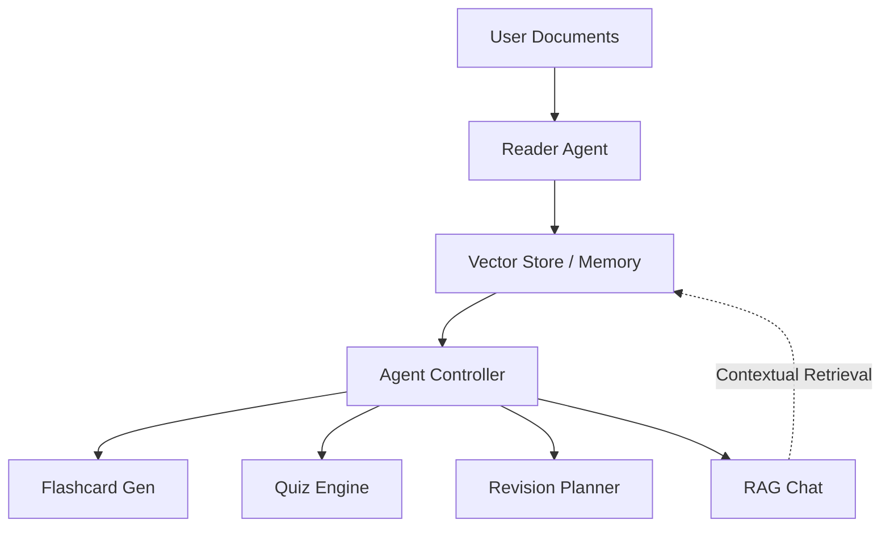

# ⚔️ THE ARSENAL: AI-POWERED MULTI-AGENT STUDY ECOSYSTEM ⚔️

### Engineered by Mr. Vansh Jain · Hack Infinity 2025 Finalist

> *"With great power, comes great... wait, wrong franchise. WITH MAXIMUM EFFORT, COMES MAXIMUM GRADES!"* — Deadpool (probably)

---

## 🚀 PROJECT OVERVIEW
**The Arsenal** is a sophisticated Multi-Agent RAG (Retrieval-Augmented Generation) system designed to transform unstructured study materials into high-impact learning assets. Built with **Streamlit**, **LangChain**, and **Google Gemini**, it orchestrates a fleet of specialized AI agents to automate document analysis, revision planning, and knowledge assessment.

*Note from Vansh:* "Look, we all know studying can be dry. I built this to weaponize your documents and make the process high-octane and efficient."

---

## 🛠️ THE TACTICAL TECH STACK
*   **LLM Orchestration:** LangChain with Google Gemini 1.5 Flash
*   **Vector Database:** ChromaDB (Semantic search with fallback embedding backends)
*   **Frontend:** Custom-styled Streamlit (Comic-themed CSS architecture)
*   **Document Processing:** PyPDF2, python-docx, and OCR fallback
*   **Architecture:** Multi-Agent Controller pattern for inter-agent communication

---

## 🧑‍💻 THE AGENT SQUADRON

### 📤 1. THE READER AGENT (Data Ingestion)
Performs surgical extraction of text from PDF, DOCX, and TXT files. It handles semantic chunking and topic classification to ensure context is preserved for the entire pipeline.
> *"It shreds your files faster than a bullet train. No leftovers, just pure intel."*

### 📇 2. THE FLASHCARD AGENT (Active Recall)
Automatically generates optimized Q/A pairs with dynamic difficulty tagging. Supports export to Anki-compatible CSV formats for spaced repetition.

### 🎯 3. THE QUIZ AGENT (Assessment)
Constructs adaptive multiple-choice quizzes. It evaluates performance in real-time, providing detailed explanations for every correct and incorrect answer.

### 📅 4. THE PLANNER AGENT (Strategic Roadmap)
Analyzes extracted topics to build a day-by-day revision schedule. It prioritizes high-weightage topics and tracks "Mission Completion" status.

### 💬 5. THE CHAT AGENT (Contextual RAG)
A specialized interrogation module that answers questions strictly based on the uploaded "intel." No hallucinations—just grounded facts.

---

## 🛡️ SYSTEM ARCHITECTURE


---

## 🏃 DEPLOYMENT INSTRUCTIONS

1. **Clone the Repository:**
   ```bash
   git clone https://github.com/vjain5375/the-bug-slayers-final.git
   cd the-bug-slayers-final
   ```

2. **Configure Environment:**
   Install dependencies via pip:
   ```bash
   pip install -r requirements.txt
   ```

3. **Ignite the Engine:**
   ```bash
   streamlit run app.py
   ```

---

## 🤝 CONNECT WITH THE ARCHITECT
**Mr. Vansh Jain**  
GenAI Developer | UI/UX Enthusiast | Multi-Agent Systems Tinkerer

- 🧠 **Focus:** AI Workflows, Document Intelligence, & Immersive Frontends.
- 💌 **GitHub:** [@vjain5375](https://github.com/vjain5375)
- 💼 **Mission:** Hack Infinity 2025 Finals

---

***Disclaimer:** No chimichangas were harmed in the making of this software. Study responsibly, or don't. I'm a README, not your mom.*
