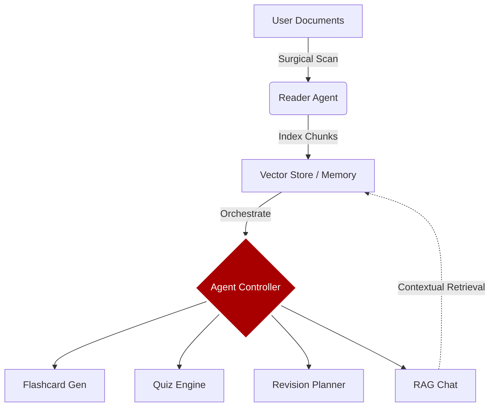

# ⚔️ THE ARSENAL: AI-POWERED MULTI-AGENT STUDY HUB ⚔️

### "Oye, Recruit! Engineered by Mr. Vansh Jain · Hack Infinity 2025 Finalist"

> *"With great power, comes great... wait, wrong franchise. WITH MAXIMUM EFFORT, COMES MAXIMUM GRADES!"* — Deadpool (probably while eating a paratha)

---

## 🎭 MISSION BRIEFING (Vansh's Tactical Overview)
Look, we all know studying usually feels like staring at a blank wall until your brain melts. **The Arsenal** was built to weaponize that boredom. This is a sophisticated **Multi-Agent RAG System** designed by **Mr. Vansh Jain** to transform dry PDFs into high-octane study tools.

*Message from Vansh:* "I wanted to build something that actually helps students without the snooze-fest. So, I strapped a Deadpool mask onto a fleet of AI agents and told them to slice through documents like a katana through butter."

---

## 🛠️ THE TACTICAL TECH STACK (The Hardware)
*   **LLM Orchestration:** LangChain with Google Gemini 1.5 Flash (Surgical accuracy, zero fluff)
*   **Vector Database:** ChromaDB (Semantic memory that never forgets... unlike you after a weekend)
*   **Frontend:** Custom-styled Streamlit (Aggressive Comic-Book CSS architecture)
*   **Document Processing:** PyPDF2, python-docx, and OCR fallback (No document left behind)
*   **Architecture:** Multi-Agent Controller Pattern (The agents talk to each other so you don't have to)

---

## 🧑‍💻 THE AGENT SQUADRON (The Muscle)

### 📤 1. THE READER AGENT (Data Ingestion)
Performs surgical extraction of text from your "intel" (PDF, DOCX, TXT). It handles semantic chunking and topic classification. 
> *"It shreds your files faster than I shred bad guys. No leftovers, just pure actionable intel."*

### 📇 2. THE FLASHCARD AGENT (Active Recall)
Generates high-impact Q/A pairs with dynamic difficulty tagging. Supports export to Anki for when you actually decide to study.

### 🎯 3. THE QUIZ AGENT (Assessment)
Constructs adaptive quizzes that hit you where it hurts. It evaluates performance in real-time with explanations that actually make sense.

### 📅 4. THE PLANNER AGENT (Strategic Roadmap)
Analyzes extracted topics to build a day-by-day "Battle Plan." It prioritizes high-weightage sectors and tracks your "Mission Completion."

### 💬 5. THE CHAT AGENT (Contextual RAG)
A specialized interrogation module that answers questions strictly based on the documents. No hallucinations—just cold, hard facts.

---

## 🛡️ SYSTEM ARCHITECTURE (The Flow)


---

## 🚀 DEPLOYING THE ARSENAL (Installation)

Oye, listen up! Ready to suit up? Follow these steps:

1. **Clone the Legend:**
   ```bash
   git clone https://github.com/vjain5375/the-bug-slayers-final.git
   cd the-bug-slayers-final
   ```

2. **Suit Up (Dependencies):**
   ```bash
   pip install -r requirements.txt
   ```

3. **Full Power Ignite:**
   ```bash
   streamlit run app.py
   ```

---

## 🤝 CONNECT WITH THE MASTERMIND
**Mr. Vansh Jain**  
GenAI Developer | UI/UX Enthusiast | Multi-Agent Systems Legend

- 🧠 **Mission:** Revolutionizing AI workflows and document intelligence.
- 💌 **GitHub:** [@vjain5375](https://github.com/vjain5375)
- 💼 **Status:** Hack Infinity 2025 Finalist — **READY FOR ACTION**

---

***Disclaimer:** No chimichangas were harmed in the making of this software. Study hard, play harder. I'm a README, not your mom.*
